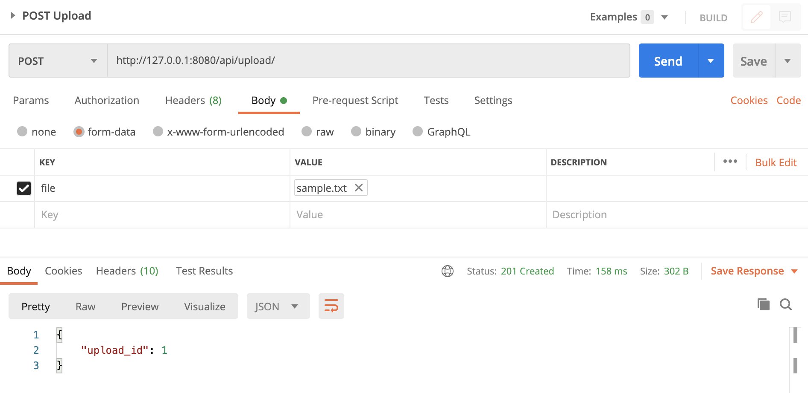
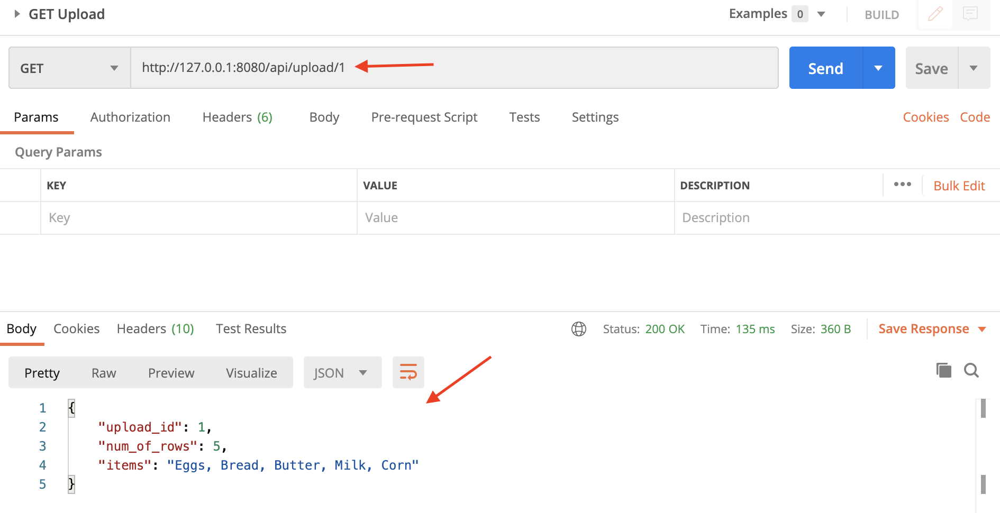
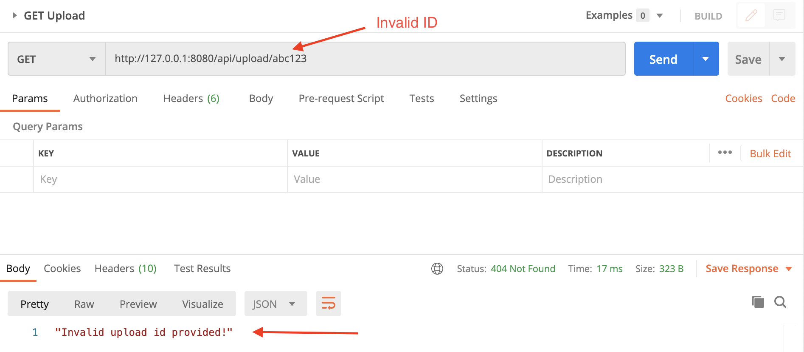
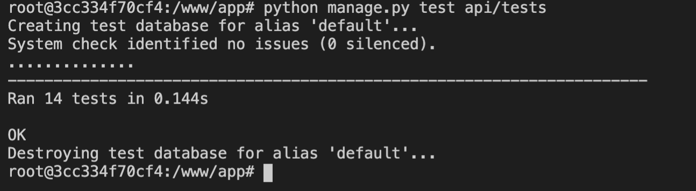

# API-First-Backend
An API-frst backend using Python and Django Rest Framework (DRF)

This exercise demonstrates how to upload and process a pipe delimited text file to extract information contained within the file and store it in the database using and API endpoint. It also demonstrates how to retrieve the information based on a file id.


### Requirements

- Use Django Rest Framework (DRF) for the backend
- Use PostgreSQL database
- Dockerize the application so that it can be run end-to-end using `docker-compose up`

- **Upload endpoint** - `/api/upload`
  - POST-BODY: a pipe (`|`) delimitted TXT file. Output: `HTTP 201` response with JSON output of the number of lines in the file. JSON output shall contain the id of the upload (each new uplaod results in an incremented `<upload_id>`). 
  - Action: The data extracted from the uploaded file is persisted into a PostgreSQL database. The format of the file will be: `<order_id> | <product_name> | <product_quantity>`. Example: `2 | Eggs | 20`
  - Sample Response:
    ```json
    {"upload_id": 1}
    ```
- **Read Endpoint** - `/api/upload/<upload_id>`
  - GET: Pass in the `<upload id>`. Output: `HTTP 200` response with JSON output of the upload id
  - Action: Fetch the details for the passed in `<upload_id>`
  - Sample Response
    ```json
    {"upload_id": 1, "number_of_rows": 5, "items": "Egg, Bread, Butter, Milk, Corn"}
    ```


### Prerequisite

- [Docker Desktop](https://docs.docker.com/desktop/)
- [Postman](https://www.postman.com/downloads/) (if manually testing endpoints)


## Contents

- [Setup and Usage](#Setup-and-Usage)
- [Manual Testing with Postman](#Manual-Testing-with-Postman)
- [Unit and Integration Testing](#Unit-and-Integration-Testing)
- [API Documentation](#API-Documentation)


### Setup and Usage

- **Docker Container Setup**

    _Note: The latest Docker Desktop is required to already be installed on your system._

    1. Make sure Docker is already running, then from the `/backend` directory run:

        ```
        docker-compose up
        ```

    2. Once the container is built and running, you can begin testing the endpoints using either `Curl` or `Postman`. A Postman collection has been provided and is located in the `/postman` directory. Please see the [Manual Testing with Postman](#Manual-Testing-with-Postman) section below for more information.

    Also see the [Unit and Integration Testing](#Unit-and-Integration-Testing) section below for information on running the tests either locally or within the Docker container.


### Manual Testing with Postman

_Note: You should already have the Docker container running before completing these steps._

1. In the **backed/postman/** directory, inport the **File Upload API.postman_collection.json** into Postman.

2. You will see a _GET_ and _POST_ request that you can use to test with. Select the **POST** request, then look under Body and click on **Select File** next to the **File** key and choose the provided **sample.txt** file (also located in the same directory as the postman collection).

3. Next, click on **Send** to send the text file to the upload endpoint.



4. You should see a response which returns the following JSON response:

    ```
    {"upload_id": 1}
    ```

5. Feel free to modify the _sample.txt_ file and add additional rows of items using the same pipe (`|`) delimitted format, then submit the _POST_ request again. This should result in an increased `upload_id` each time you send the request. The uploaded files are stored in the **backend/uploads/files/** directory path.

6. Next, select the **GET** request, and you should note in the URL path there is already an id of `1` provided.

7. Click **Send** to send this request and you should get back a JSON response with some items and information from the uploaded file.

    ```
    {"upload_id": 1, "number_of_rows": 5, "items": "Egg, Bread, Butter, Milk, Corn"}
    ```
  


8. To test what happens when an invalid id is entered, change the number to something else like `5` or `abc` and click **Send**. You should get back an error message saying that the upload id is not valid.




### Unit and Itegration Testing

The included tests cover API, Unit and Integration tests by testing the endpoints, the model and the views.

- **Using Docker Container**

  In a new terminal window, with your Docker container already running, use the following command to enter the container:

  ```
  docker exec -it backend_web_1 /bin/bash
  ```

  Then run the following command to run all the tests:

  ```
  python manage.py test api/tests
  ```

  14 Tests should come back as **OK** with no errors.

  
  

### API Documentation

With the Docker container already running, click on a link below to view the auto generated API documentation from either **ReDoc** or **Swagger**.

- [ReDoc](http://localhost:8080/api)
- [Swagger](http://localhost:8080/api/swagger)